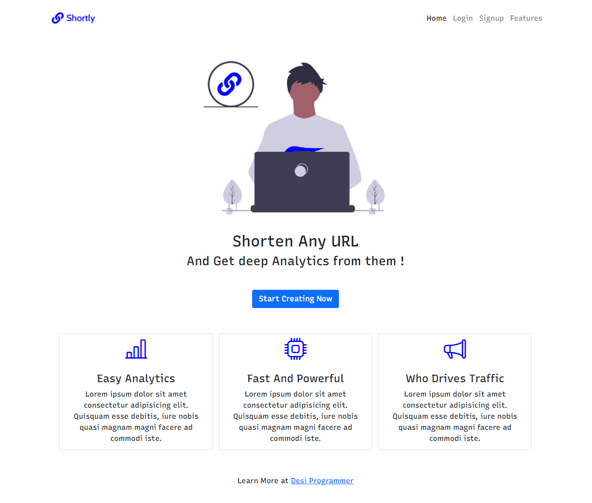
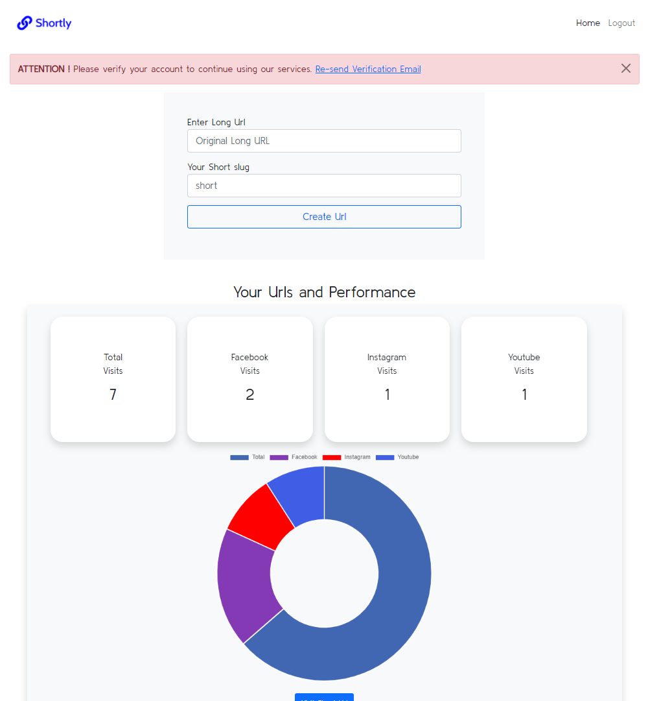

# Shortly - A Short Url Service In Node JS With Data Visualization

This repo contains code for a Short URl Service Coded In NODE JS !

## Tutorial (Shortly) : [Here](https://youtu.be/zuXQH-PDWuY)

## Tutorial (Local Auth) : [Here](https://www.youtube.com/watch?v=-ZxXS9gsWX4)

## Tutorial (Google Auth) : [Here](https://www.youtube.com/watch?v=d-IToO3gLrM)

## 1. USAGE

### Install All Packages

```bash
npm install express ejs mongoose bcryptjs connect-flash cookie-parser express-session csurf memorystore passport passport-local passport-google-oauth20 nodemailer
```

### Install Nodemon For Development

```bash
npm install -D nodemon
```

### Add mongoURI ,Google client ID and Secret, smtp config for sending emails 
### And Feel free to delete the screenshots directory

# Added Options





